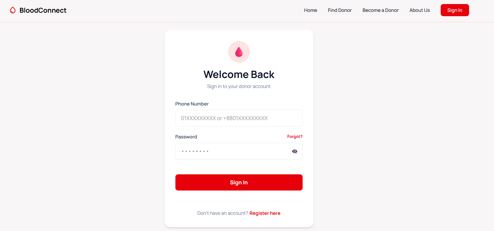
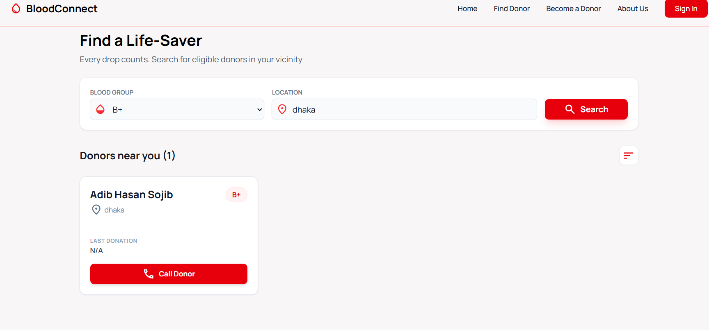
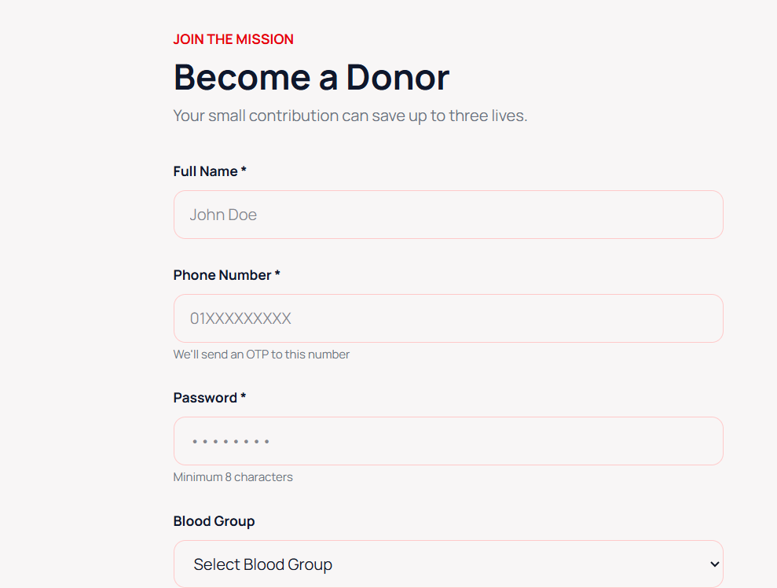
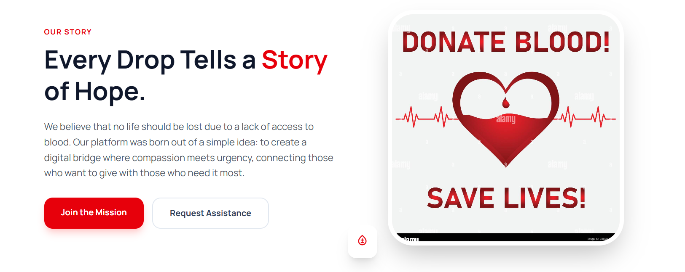
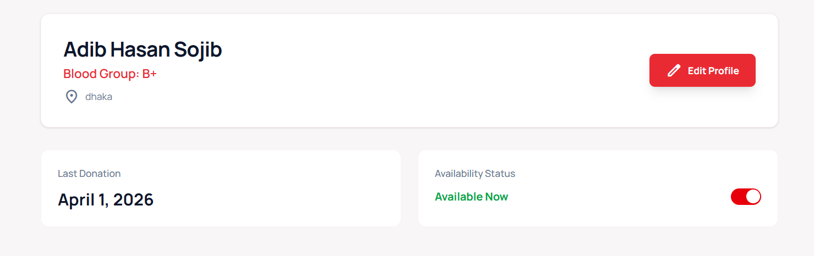
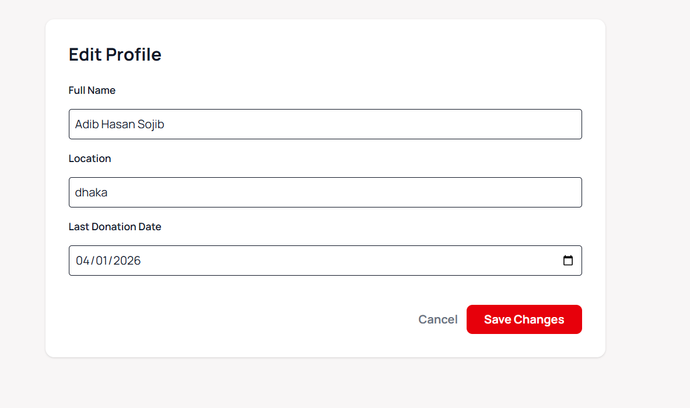
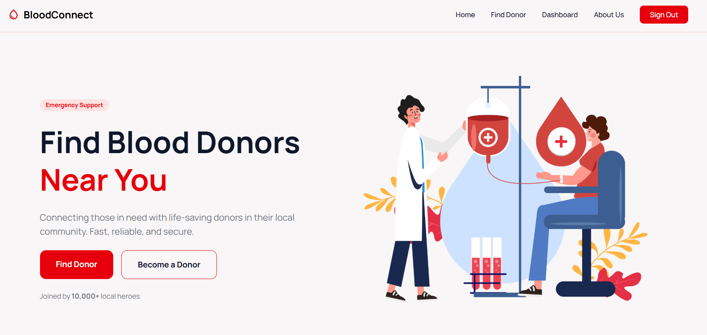

# 🩸 Blood Connect

A full-stack web application designed to connect **blood donors** with **people in need (seekers)** efficiently based on location and blood group.

---

## 🚀 Project Overview

**Blood Connect** is a smart platform that helps users:

- 🔍 **Find blood donors** quickly using blood group and location  
- 🧑‍🤝‍🧑 **Register as a donor** to help others  
- 🔐 **Securely sign in** and manage their profile  
- 📍 **Locate nearest donors** in real-time  
- 📞 **Directly contact donors** via phone and address  
- 🟢 **Control availability status** based on donation activity  

---

## ⚙️ Core Features

### 🧑‍⚕️ Donor Panel
- Easy registration and login system  
- Secure authentication  
- Availability control system:
  - ❌ Automatically or manually set unavailable after donating blood  
  - ✅ Reactivate availability after recovery  

### 🔎 Seeker Panel
- Search donors using:
  - Blood group  
  - Location  
- Access donor details:
  - Name  
  - Phone number  
  - Address  
- Instantly connect with donors  

---

## 📁 Project Structure
Based on the current development environment:

### 🖥️ Backend
```bash
Backend/
├── config/             
├── controllers/        
├── middlewares/        
├── models/             
├── node_modules/       
├── routes/             
├── utilities/          
├── .env                
├── package.json        
└── server.js           
```

### 🌐 Frontend
```bash
Frontend/
├── dist/               
├── public/             
├── src/                
├── .env                
├── index.html          
├── package.json        
├── tailwind.config.js  
└── vite.config.js      
```

---

## 🏗️ Tech Stack

### 🌐 Frontend
- React.js  

### 🖥️ Backend
- Node.js  
- Express.js  

### 🗄️ Database
- MongoDB  

### 🔐 Security & Optimization
- `bcryptjs` → Secure password hashing  
- `express-rate-limit` → Protect against excessive requests  

---

## 🔄 System Workflow

1. User registers as a donor  
2. Donor logs in and sets availability  
3. Seeker searches using blood group + location  
4. System shows nearest available donors  
5. Seeker contacts donor directly  
6. Donor donates blood → marks themselves unavailable  
7. After recovery → donor becomes available again  

---

## 🚀 Getting Started

### Prerequisites
```plaintext
Node.js (v16 or higher)
MongoDB account/local instance
npm or yarn 
```
### Installation
Clone the repository:
```bash
git clone https://github.com/rizowan-rafi/Life-Stream_for_attachment
```
### Backend Setup:
```bash
cd Backend
npm install
```
Create a .env file in the Backend/ folder:
```bash
MONGODB_URL=your_mongodb_url_here
CLIENT_URL=http://localhost:5173
PORT=3000
JWT_SECRET=your_jwt_secret_here
```
Install nodemon:
```bash
npm install -g nodemon
```

Start server: 
```bash
npm run dev
```

### Frontend Setup
```bash
cd ../Frontend
npm install
npm run dev
```
Create a .env file in the Frontend/ folder:
```bash
# Frontend Environment Configuration

# Backend API Base URL (change based on your backend deployment)
VITE_BASE_URL=http://localhost:3000


```
---

## 📸 Screenshots & Demo
### 🖼️ App Preview
#### login screen

#### find-donor screen

#### register screen

#### about-us screen

#### dashboard screen

#### edit-profile screen

#### home screen



## 👥 Contributors

- Md Tamim Iqbal  
- Rizowan Mahmud Rafi  
- Abir Hasan  
- Sadnan Jamiul Haque  
- Fahimul Kadir Adib  

---

## 💡 Future Improvements

- 🗺️ Google Maps integration for more accurate location tracking  
- 🔔 Notification system (SMS/Email alerts)  
- 📱 Mobile app version  
- 📊 Donor activity analytics  

---

## ❤️ Motivation

The goal of **Blood Connect** is to **save lives** by minimizing the time required to find blood donors and making the entire process seamless and accessible.

---

## 📌 License

This project is open-source and available under the MIT License.

---

> “Donate blood, save lives.” 🩸